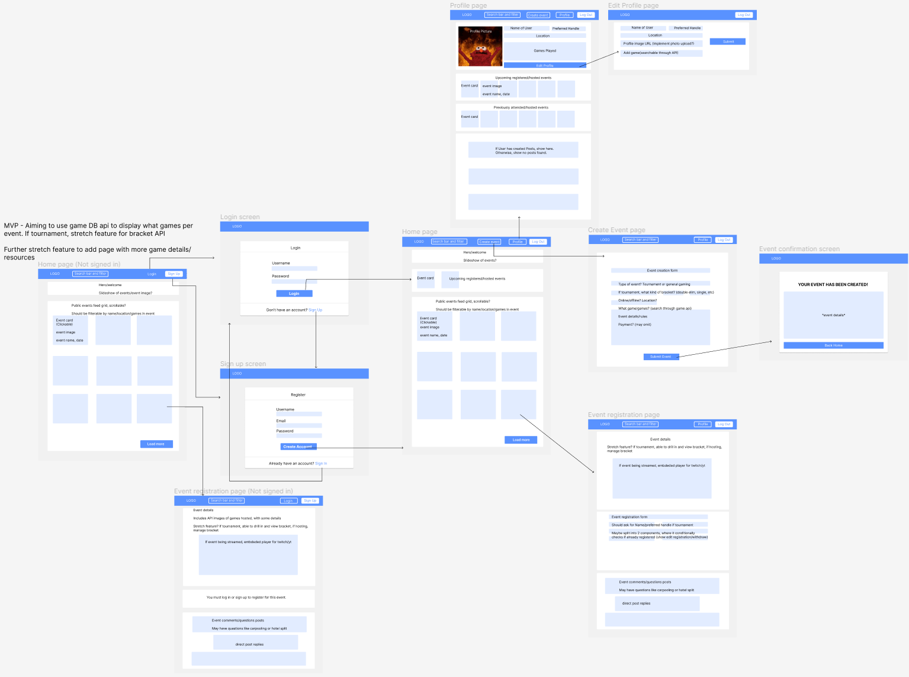

# Project Plan

Pod Members: **Amber Lewis, James Bosch, Angelo Alvarado, Charidi Stevens**

## Problem Statement and Description

Video games are a huge market across the globe, where anyone in your family could be a gamer, young or old. Because of this, gaming can be used to bring people together and there is a need to facilitate that growth and also allow others to find like-minded individuals.

#### ***Description***:

This project will be a hub for gamers looking to attend meetups and events (competitive or casual). This site will include user profiles, event management, and event specific comments to communicate with others attending or interested.

#### ***Key Features***:

User Profiles
Create/Host Events
Specify if casual or competitive event, with specific games
List and Filter upcoming events
Comments section within events, allowing users to ask questions/communicate

## User Roles and Personas

### User Roles
- Gamer
- Event Coordinator

### User Personas
- Gamer
  - Angelo is a 20 year old who lives in a border town in South Texas. He is a student at a university. He plays video games often, and loves to play with new groups of people. It is difficult for him to find people to play with.
  - Kristie is a 23 year old teacher who lives in New York City. During the pandemic she has grown a fondness for video games and considers herself a gamer. Now that her interests in video games have grown and events are starting up, she wants to be part of a community of gamers to widen her interests. 
  - Fabian is a 20 year old who lives in Detroit. He is a student at a university. He has played many video games, and would love to find a community in his area that shares the same interests.
   
- Event Coodinator
  - James is a 30 year old who lives in New York City. He is a student at a local university and also works in IT. He enjoys the community that fighting games bring, and has hosted local events in the area for them. He would like to use an application to centralize this event hosting to see RSVPs and potential guests while also displaying information on which platform the event will play on, location, and possible venue fees.
  - Hector is a 25 year old who lives in San Antonio. He works at a local marketing company, and he is interested in making brackets for fighting game tournaments. He has never made one before, but would like to use a bracket maker that simplifies the creation process for him.

## User Stories

- As a gamer, I would like to meet others online who are part of a game community, so that I can meet and have discussions with others.
- As an event coordinator, I would like to see a list of users who RSVP'd to my events to plan accordingly
- As an event coordinator, I want to create brackets for users so that I can run tournaments more smoothly
- As an event coordinator, I want to announce video game events, so that I can introduce new and experienced gamers to meet up
- As a competitive gamer, I want to compete in fighting tournaments, so that I can hone my skills and network with others 
- As a social gamer, I want to seek out events, so that I can play party games and other multiplayer games with other gamers
- As an old-school gamer, I want to connect with other like-minded gamers, so that we can discuss what games make us feel nostalgic
- As a new gamer, I want to compete with other gamers in fighting tournaments, so that I can experience my first gaming tournament and widen my friend circle
- As a casual gamer, I want to attend local and large events so that I can meet others, spectate, and network
- As an event coordinator, I want to schedule in person and virtual events, so that I can foster growth in my local community

## Pages/Screens

## Data Model

| **Column Name**        | **Type**  | **Description**                                                                      |
|------------------------|-----------|--------------------------------------------------------------------------------------|
| **Users**              |           |                                                                                      |
| id                     | integer   | primary key                                                                          |
| username               | text      | preferred name of user                                                               |
| password               | text      | user's password                                                                      |
| first_name             | text      | user's first name                                                                    |
| last_name              | text      | user's last name                                                                     |
| email                  | text      | user's email                                                                         |
| created_at             | date      | date where the user was created                                                      |
| image_url              | text      | user profile image                                                                   |
|                        |           |                                                                                      |
| **Events**             |           |                                                                                      |
| id                     | integer   | primary key                                                                          |
| event_name             | text      | the event's name                                                                     |
| event_type             | text      | the event's type (tournament or general gaming)                                      |
| location               | text      | online, offline (if offline, select a location)                                      |
| event_game             | integer[] | the game that will be played at the event (array of ints, using id from game api?)   |
| event_details          | text      | details/rules of the event provided by the event coordinator                         |
| event_image_url        | text      | image for event                                                                      |
| user_id                | integer   | foreign key references users(id)                                                     |
|                        |           |                                                                                      |
| **RegisteredEvent**    |           |                                                                                      |
| id                     | integer   | primary key                                                                          |
| preferred_name         | text      | preffered name/handle of attendee (Might be better on users table?)                  |
| registered_at          | date      | date the user registered for the event (is this needed?)                             |
| user_id                | integer   | foreign key references users(id)                                                     |
| event_id               | integer   | foreign key references Event(id)                                                     |
| registered_game        | integer[] | May need field for games registered to                                               |
|                        |           |                                                                                      |
| **Posts**              |           |                                                                                      |
| id                     | integer   | primary key                                                                          |
| post                   | text      | content of post                                                                      |
| created_at             | date      | date/time post created                                                               |
| user_id                | integer   | foreign key references users(id)                                                     |
| event_id               | integer   | foreign key references Event(id)                                                     |
|                        |           |                                                                                      |
| **PostReplies**        |           |                                                                                      |
| id                     | integer   | primary key                                                                          |
| reply                  | text      | content of reply                                                                     |
| created_at             | date      | date/time reply created                                                              |
| user_id                | integer   | foreign key references Users(id)                                                     |
| post_id                | integer   | foreign key references posts(id)                                                     |
|                        |           |                                                                                      |
| **Stretch**            |           |                                                                                      |
| EventTournaments?      |           | Intended for if Bracket API is implemented                                           |
| RegisteredTournaments? |           | Intended for if Bracket API is implemented                                           |
| Resources?             |           | May need table for extra game resources intended for learning or finding communities |

## Endpoints

| **URL**                    | **CRUD** | **HTTP Verb** | **Description**                                                 | **User Stories**         | **Stretch?** |
|----------------------------|----------|---------------|-----------------------------------------------------------------|--------------------------|--------------|
| **events**                 |          |               |                                                                 |                          |              |
| \events                    | Read     | GET           | Fetch all events from events table                              |         1, 5, 6, 7, 8, 9 |              |
| \events                    | Create   | POST          | Add an event to the website                                     |        1, 2, 3, 4, 7, 10 |              |
| \events\:id                | Read     | GET           | Fetch specific event                                            |               2, 5, 6, 9 |              |
| \events\:id\users          | Read     | GET           | Fetch all users for a specific event from the registered events |                    2, 10 |              |
| \events\:id                | Delete   | DELETE        | Remove an event from the events table                           |                       11 | **Stretch**  |
| \events\:event_id\register | Create   | POST          | Register user to the event                                      |         1, 5, 6, 7, 8, 9 |              |
| \events\:event_id\withdraw | Delete   | DELETE        | Remove/withdraw a user from the registered events table         |         1, 5, 6, 7, 8, 9 | **Stretch**  |
| \events\:id                | Update   | PUT           | Update event information                                        |                 2, 3, 10 | **Stretch**  |
|                            |          |               |                                                                 |                          |              |
| **users**                  |          |               |                                                                 |                          |              |
| \users\:id                 | Read     | GET           | Fetch specific user                                             |                   12, 13 |              |
| \users\:id\events          | Read     | GET           | Fetch all events in a user's collection                         |                       12 |              |
| \users                     | Create   | POST          | Create a new user account                                       | 1, 5, 6, 7, 8, 9, 12, 13 |              |
| \users\:id                 | Update   | PUT           | Update user's profile data                                      |                       13 |              |
|                            |          |               |                                                                 |                          |              |
| **posts**                  |          |               |                                                                 |                          |              |
| \posts                     | Create   | POST          | Create a new post for an event (event id in the body)           | 1, 5, 6, 7, 8, 9, 10, 11 |              |
| \posts\:post_id            | Delete   | DELETE        | Delete a post                                                   | 1, 5, 6, 7, 8, 9, 10, 11 |              |
| \posts                     | Update   | PUT           | Update a post                                                   | 1, 5, 6, 7, 8, 9, 10, 11 | **Stretch**  |
|                            |          |               |                                                                 |                          |              |
| **postreplies**            |          |               |                                                                 |                          |              |
| \reply                     | Create   | POST          | Create a new post reply (post id in the body)                   |         1, 5, 6, 7, 8, 9 |              |
| \reply\:reply_id           | Delete   | DELETE        | Delete a post reply                                             |         1, 5, 6, 7, 8, 9 |              |
| \reply\:reply_id           | Update   | PUT           | Update a post reply                                             |         1, 5, 6, 7, 8, 9 | **Stretch**  |

***Don't forget to set up your Issues, Milestones, and Project Board!***
